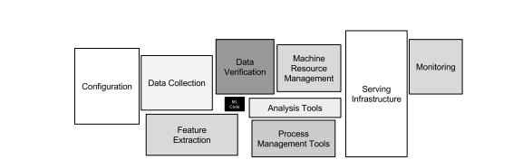

# 离职人数预测

## Define Project
通过对公司历史离职数据的分析，挖掘其中存在的信息，构建时间序列的特征数据，构建模型，预测未来的可能离职人数。

## Data
### Define data

人事部门对离职方式做出了以上定义，其中我根据实际情况以及数据业务逻辑针对性的进行了处理，选择了离职方式为**辞职、辞职1、急辞、自离、自离1**这些离职方式的数据作为目标数据进行预测。其他离职方式的数据不选用的原因解释如下：
* 放弃入职：没入职本身就不应该算作离职数据，不应该存在于离职数据表；
* 黑名单：根据与IT部门的沟通和数据的展示情况，这部分数据是IT不定时的人工导入，同时也不是离职数据，不应该存在于离职数据表；
* 离厂：这部分数据比较特殊，后面会单独进行说明；
* 外调：外调并不属于离职，属于公司自身对员工的调整，不能正常反映员工的离职情况，也不应该位于离职表；
* 用掉：没入职本身就不应该算作离职数据，不应该存在于离职数据表；


### Organize data
根据之前分析数据显示，公司从2018~2023年，由于自动化程度的提高，公司的在职员工数是有明显减少，相对应的离职人数也会明显减少；同时由于前几年有疫情的影响，所以离职人数的趋势略有不同，另外节假日和农历新年这些时间因素离职有强影响，所以需要训练数据至少包括一个完整的农历年和公历年，所以最终数据采集如下：

本次训练使用2021-01-01~2023-12-31白石园区的普工数据，其中2021-01-01~2022-12-31的数据作为训练base，然后迭代训练预测2023年每一天的数据。

## Model
### Training result


### Evaluate 
1. MAE:41.07671232876712
2. $r^2$: 0.6556476495029129

MAE表示在2023年365天维度来看，平均每天的绝对误差是41人，$r^2$表示模型预测的趋势相关性；
对于具体的数据：
* 误差绝对值<50的天数:264天,占比:0.7232876712328767;
* 误差绝对值在50~100的天数:63,占比:0.1726027397260274
* 误差绝对值在100~200的天数:34,占比:0.09315068493150686
* 误差绝对值超过200的天数:4,占比:0.010958904109589041

**综上：误差绝对值在100以内的天数为327，占比约90%**

## Special Note
### 离厂数据解读
前文提到，对于离职方式为离厂的这部分数据需要单独处理，主要原因如下：
1. 2021,2022,2023年派遣工离职的数据曲线出现了显著的数据漂移情况，模型从之前的序列训练的参数，对2023年的数据预测情况不会好。
2. 派遣工与正常员工的一个显著区别在于派遣工会签订一个定期的合同（例如3个月），合同到期后，派遣工会出现一个批量离职的情况（例如某天离职8000+），这种情况会造成明显的数据异常。
3. 根据数据的表现情况，公司2023年派遣人员无论是在职情况还是离职情况，都有了明显下降，猜测是由于业务的政策调整，这种对于模型预测也是不利的。

**综上，个人认为对于派遣员工这部分的离职情况，需要再详细了解业务情况进行针对性的处理。可以单独对这部分数据进行预测，也可以通过对业务的拆分进行后端相关功能的开发，达到一个补充的效果。**

### 总结和后续优化
1. 与业务部门的沟通至关重要，很多非标准化的数据or明显异常的数据是由于一些未知的操作造成，如果简单的优化掉or处理都会造成数据的偏差和理解不充分；
2. IT部门对数据库是否应该更好的优化，很多不同类别的数据是否不应该存在于同一张表内，数据标准化和结构化有改善的空间；
3. 对于模型预测结果，结合相关政策和现实情况，可以做进一步的强处理，提升可用性；


## Deploy
### 精密园区的预测情况
将同样的思路运用于精密园区的数据，比对预测结果，查看该方案的可部署和可扩展性。
1. MAE:26.994520547945207
2. $r^2$: 0.6200709738688395

MAE表示在2023年365天维度来看，平均每天的绝对误差是27人，$r^2$表示模型预测的趋势相关性；
对于具体的数据：
* 误差绝对值<50的天数:300,占比:0.821917808219178;
* 误差绝对值在50~100的天数:48,占比:0.13150684931506848
* 误差绝对值在100~200的天数:17,占比:0.04657534246575343

**综上：误差绝对值在100以内的天数为348，占比约95.5%**

## 附录
### 探究总结
1. data collection
2. data clean and visual analysis
3. timeseries analysis
4. model 
    1. timeseries model
        * ES
        * AR
        * ARIMA
        * Prophet
    2. ML model
        * Linear model
        * tree model
        * ensembel model
    3. DL model
        * NLinear
        * DLinear
        * Transfomer
5. Model Optimization:Lightgbm and XGBoost
    1. data optimization
        * add new features
        * transfomer data
    2. model retraining
        * predict 1 month
        * iterative training and predict 3 days
        * iterative training and predict 1 day
6. Evaluation of Results
    1. mae
    2. mse
    3. $r^2$

7. Handling of abnormal data
    1. 黑名单数据处理
    2. 离厂数据


## 代码结构
```
├── core
│   ├── data_operate.py
│   ├── infer.py
│   ├── __init__.py
│   ├── monitor.py
│   └── train.py
├── db
│   ├── config.py
│   ├── getdata.py
│   ├── __init__.py
├── __init__.py
├── main.py
└── utils
    ├── __init__.py
    ├── log.py
    ├── metrics.py
    ├── plots.py


```
